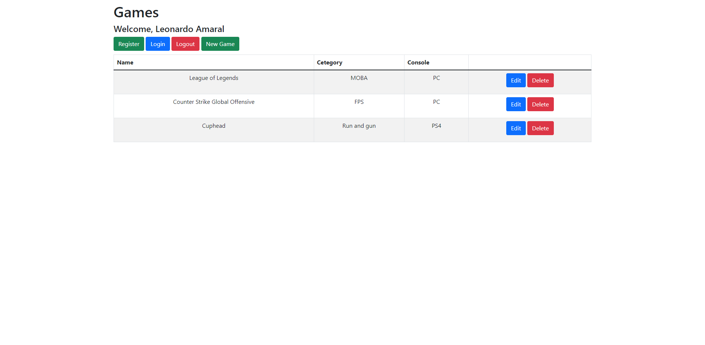
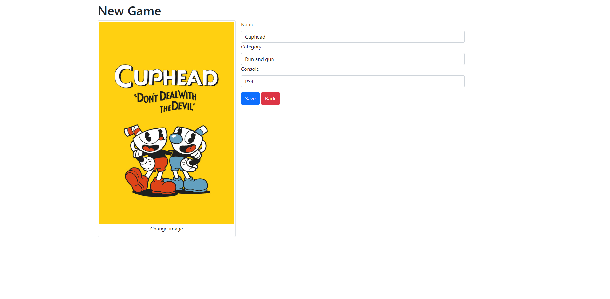

# GameTeca 🎮
## About 💭
GameTeca is a game library where people can register their favorite games. In it, you record the name, category and type of console that game belongs to. Furthermore, it's possible to attach an image of the game in question!

### Home page


### New game


## Technologies 💻
 - Python3.8 🐍
 - Flask 🌶️
 - FlaskWTF 🤔
 - MySQL 📚
 - HTML/CSS 😎
 - Github Issues 🔖
 - Docker 🐋

## Installation guide 📑
### First of all
To install it, you must have Docker on your machine. If you don't have it, click here to install it.

### Running application ⚙️
Before running the application, you need to create a file called ```.env``` to store 3 variables:
- **FLASK_SECRET_KEY**: Use a hash of your choice
- **MYSQL_USERNAME**: MySQL user. In the file ```docker-compose.yml``` it is set to ```admin```
- **MYSQL_PW**: MySQL password. In the file ```docker-compose.yml``` it is set to ```admin``` too

Commands to upload Docker and run the application:
- ```docker-compose up``` 👉 Displays the application log
- ```docker-compose up -d``` 👉 Doesn't display the application log